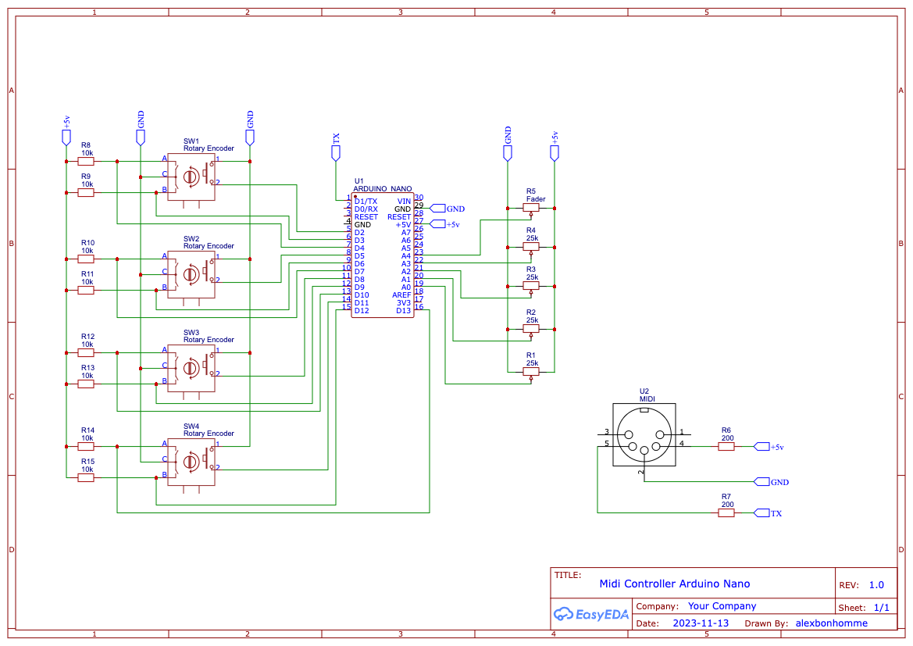

# Midi Controller

## Board

[Arduino Nano](https://docs.arduino.cc/hardware/nano)

## Dependencies

[Control Surface](https://tttapa.github.io/Control-Surface-doc)

## Schematic

> This is first minimal version

